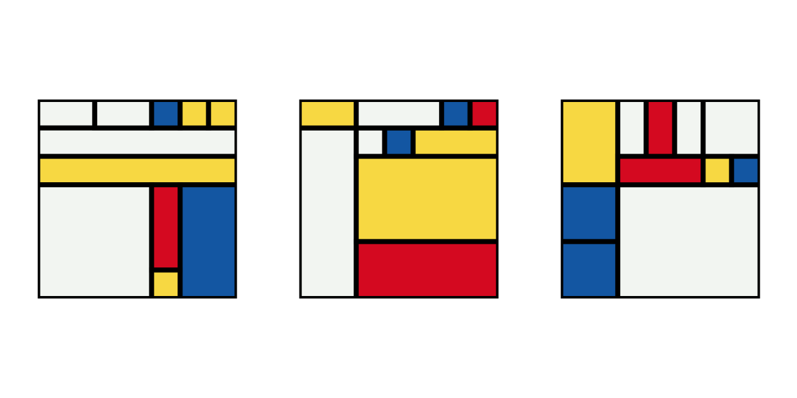

# Mondrian

Mondrian - Abstract art in your browser.

## Piet Mondrian
Pieter Cornelis Mondriaan, after 1906 Piet Mondrian (7 March 1872 – 1 February 1944), was a Dutch painter and theoretician who is regarded as one of the greatest artists of the 20th century. He is known for being one of the pioneers of 20th century abstract art, as he changed his artistic direction from figurative painting to an increasingly abstract style, until he reached a point where his artistic vocabulary was reduced to simple geometric elements.

Source: [Wikipedia][1]

## Technical details
- Angular
- TypeScript

## Credits
Inspired by [Generative Artistry][2] and [Tim Holman][3].

[1]: https://en.wikipedia.org/wiki/Piet_Mondrian
[2]: https://generativeartistry.com
[3]: https://github.com/tholman

